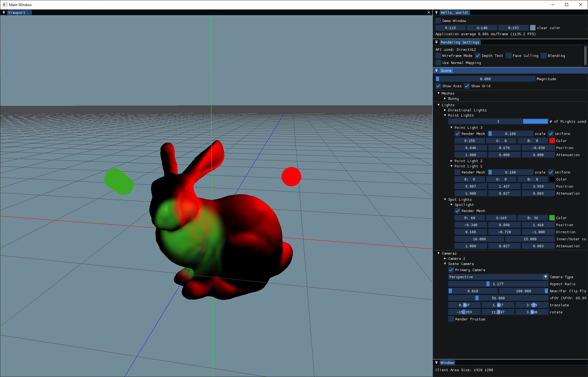
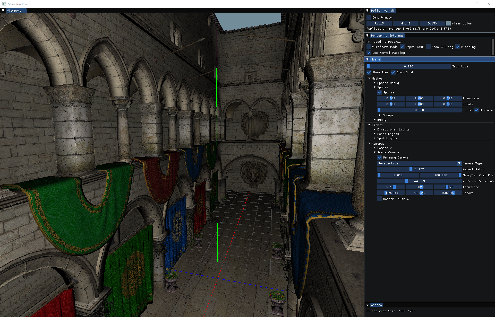
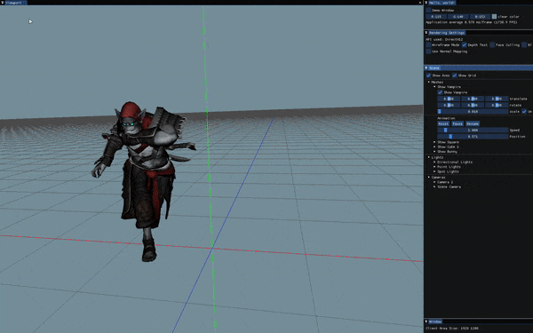

# Hedgehog

Hedgehog is a game engine project I'm using to learn about game engines, computer graphics and rendering APIs.

The engine is heavily based on [The Cherno's Hazel engine](https://github.com/TheCherno/Hazel) and his [youtube series](https://youtube.com/playlist?list=PLlrATfBNZ98dC-V-N3m0Go4deliWHPFwT).
Other major resources used include [Learn OpenGL](https://learnopengl.com/), [Braynzar Soft tutorials](https://www.braynzarsoft.net/viewtutorial/q16390-04-directx-12-braynzar-soft-tutorials), [Vulkan Tutorial](https://vulkan-tutorial.com/) and [Vulkan Guide](https://vkguide.dev/).

Mainly the renderer portion of the engine has been and is being worked on.

### Supported Platforms
- [x] Windows
- [ ] Linux

### Supported Rendering APIs
- [x] OpenGL
- [x] DirectX 12
- [ ] Vulkan [WIP]

### Features
* Window handling (bare winapi)
* Indexed Instanced Rendering
* Cameras
* Directional, Point and Spot lights
* Textures
* Normal Mapping
* Entity Component System
* Skeletal animations
* simple model loading (.tri, .obj, .dae formats)

### Feature TODO/wish list
* shadows
* defered rendering

### Third-party libraries
* [glad](https://github.com/Dav1dde/glad) for OpenGL setup
* [glm](https://github.com/g-truc/glm) for all things math
* [ImGui](https://github.com/ocornut/imgui) for GUI
* [EnTT](https://github.com/skypjack/entt) for ECS
* [stb](https://github.com/nothings/stb) for image loading
* [pugixml](https://github.com/zeux/pugixml/) for xml parsing
* [vk-bootstrap](https://github.com/charles-lunarg/vk-bootstrap) for vulkan setup

### Gallery
#### Simple model with a point light and a spotlight

#### Larger model with textures and normal maps

#### Animation

